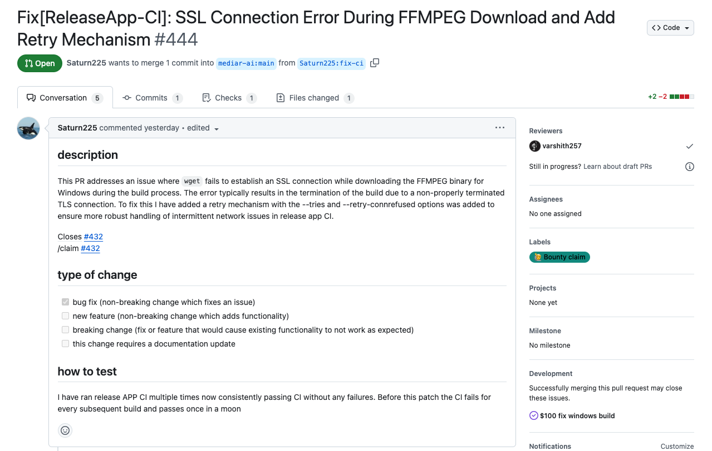
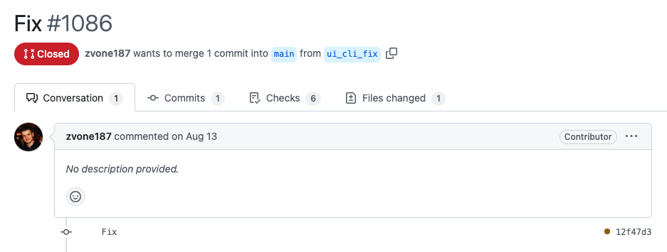

# 說明 blob, tree, commit, branch, head 分別是什麼：

1. blob:binary large object的縮寫，主要存放檔案內容。
2. Tree 主要是存放目錄、檔案資訊，指向blob或其他tree。
3. Commit：記錄commit訊息內容，包含作者、訊息及指向一個tree的指標（tree即為當時的檔案）。
4. branch：指向最新的commit的指標。
5. head：指向當前branch的指標，代表目前在哪個branch上面工作。

## image


>[參考資料](https://kaochenlong.com/2017/08/11/git-on-modern-web.html)
# 紀錄在 git repo 操作過程中，.git 檔案夾裡的變化

因為第一次使用git，前面有很多操作不順的地方，沒注意到作業要求，跟著做的時候沒有留心.git資料夾內的變化，我這邊列出幾個在執行push到github後，再pull下來的觀察：

push之前只建了一個hello.txt，並且按照老師的教程打
```
git add hello.txt"
```
會跳出找不到目錄的報錯，找網路之後才發現要先用touch建立，之後就有建立成功，這時git-workshop的資料夾確實有這個檔案建立

之後要把 main 分支推送到 origin 去也卡了好一陣子，包含不知道github的密碼原來要另外找token，找到了之後又好像是因為兩邊檔案差太多的關係？所以在後面加上「--allow-unrelated-histories」才看似成功。但現在回顧起來發現原本的hello.txt好像就不見了。

回到正題，現在把github這邊pull回來看，進到.git資料夾多了head, index等等東西，但想要cd進去看好像不行，會說他不是一個目錄

# commit message 應該怎麼寫比較好？應該有什麼 style 嗎？

查找資料之後，先講為何需要有 commit messeage :為了記錄程式碼的更動，方便日後想要回頭查找的時候才找得到（版本控制 or 遊戲存檔）。

其實想成遊戲存檔的話對我來說比較容易理解 XD（平常遊戲打比較多）

舉我自己的遊玩習慣來說：我喜歡在完成一個段落的時候存檔，也許是破完一個迷宮、探索完一個區域、又或許是刷出一個很稀有的道具 or 打完一個很難的 BOSS 之類的。

但遊戲內通常沒辦法幫存檔取名，當然存檔上面還是會有一些資訊：

（圖片回家補）

而 commit message 則是希望日後在維修的時候可以方便修改錯誤，也因此會反過來希望不要太久才 commit 一次。就像是從頭破到王關前才存檔，才發現一開始的要素沒拿，想要全收集的話只能砍掉重練。

我實際去 github 上面隨便搜尋了一個 trending repo，觀看裡面的 commit message，並搭配查找的資料來說明好壞。



>[來源](https://github.com/mediar-ai/screenpipe/pull/444)

這個 commit message 我覺得好的地方有以下幾點：
- type : 在標題的時候描述這個 commit message 的類別是什麼，常見的 type 可能有 fix, feature, bug 等等
- body : 描述這個 commit message 做了什麼更動，就這個例子來說他除了 description 以外，還有 type of change 跟 how to test 兩項幫助其他人閱讀。但 type of change 這項有看到其他 repo 是用 label 的方式來做。
- footer : 描述對應到的 issue 是哪一個



而這個 commit message 我覺得不好的地方則是只有提供一個 Fix，其他描述都沒有。這樣也許之後要回來找可能也很痛苦，或是容易跟其他 Fix 搞混。

>[來源](https://github.com/Pythagora-io/gpt-pilot/pull/1086)

