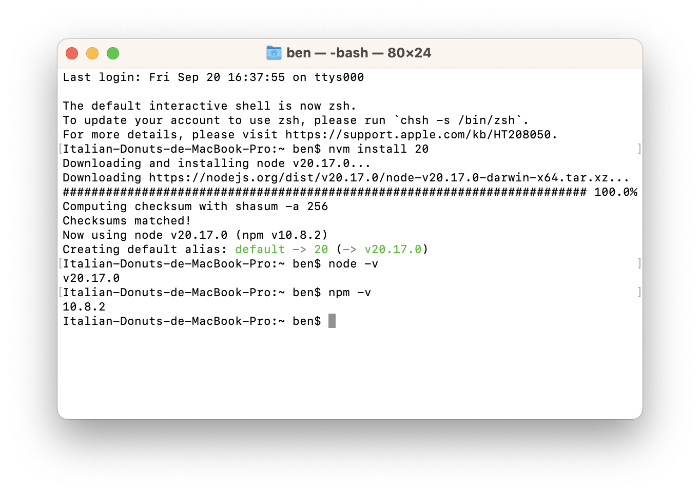

## Node.js環境準備

安裝的版本是v.20.17.0，老師上課有提到基數版本是試驗性的版本，所以優先跳過；偶數版本最新的則有v.22可選。

但我覺得v.22還正在活躍中，現在安裝的版本若有問題，也許是在之後的版本修正回來，不像v.20是LTS(long-term support)，更新不會造成太多破壞，較為穩定。
目前還沒找到組員，所以我先選擇v.20安裝。



## nvm與npm分別是什麼

- nvm是node version manager的縮寫，在下載node的時候也下了 `$ nvm install 20` 的指令，代表想要下載的版本號是20。
- npm的話則是node package manager的縮寫，用來管理專案使用到的套件。

## git interals

每個物件會被丟到SHA1 Function，雜湊出160 bits的Key值（40個英數字，16進位制），也因此相同的物件就會有相同的key值。

而老師上課也有提到檔案名稱的前兩碼會被拿來當作資料夾名稱，方便日後檢索。


可以看到.git資料夾內確實有04、1f、2e等等資料夾，而進入1f資料夾中還有一個物件。

而上課中提到的取兩碼做資料夾索引，我在想的是

1. 為何是取兩碼？這個我想是因為兩碼的資料大小剛好是1Byte（16進制的一位數需要4bits，所以兩位是8bits、1Byte），但不知道要怎麼做實驗驗證。
2. 是既然取索引這個方法降低搜索成本，那為何不取兩次？
   並且一層資料夾之後難道就不會放滿了嗎？
   目前還沒有想法如何驗證。再找資料。

## 上課的JS練習題：實作Sum函式
```
function sum(n){
	return n * (n + 1) * 0.5
}

console.log(sum(10))
```
另外還有for迴圈、遞迴等寫法

## 作業C. 程式題: sum
```
function sum(ary) {
	// TODO: sum all elements in ary
  ans = ary.reduce(function(total, e){
  	return total + e;
  });
  return ans;
}

console.log(sum([1, 5, 3, 2])); // 11
```
參考網址：
[developer.mozilla.org](https://developer.mozilla.org/zh-TW/docs/Web/JavaScript/Reference/Global_Objects/Array/reduce)
