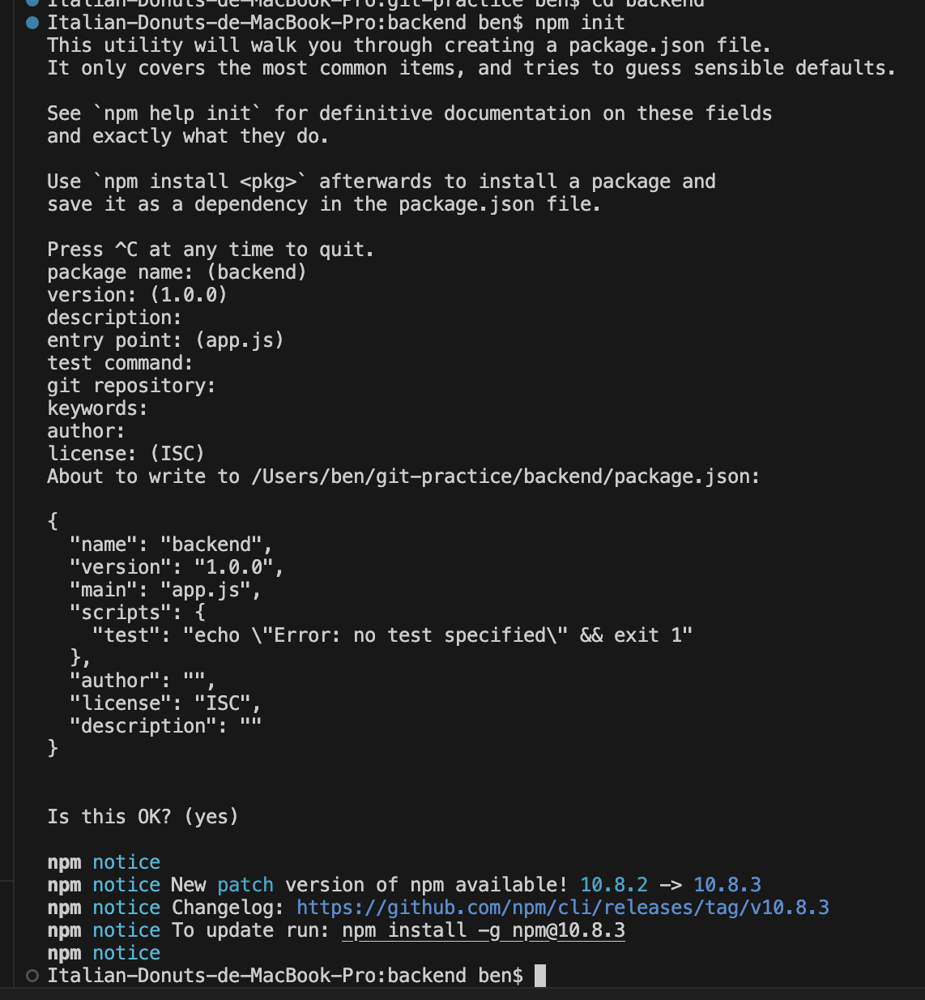
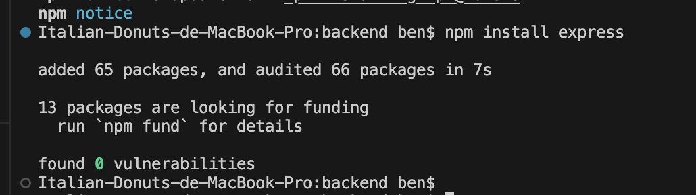
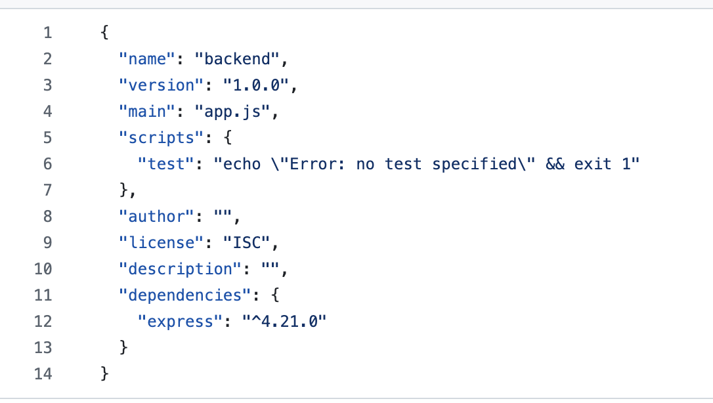
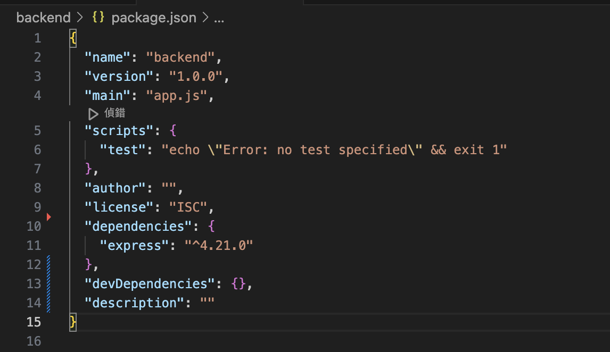
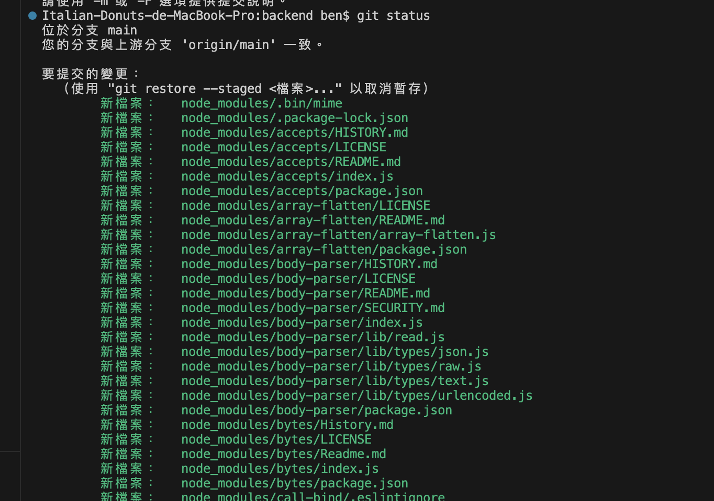
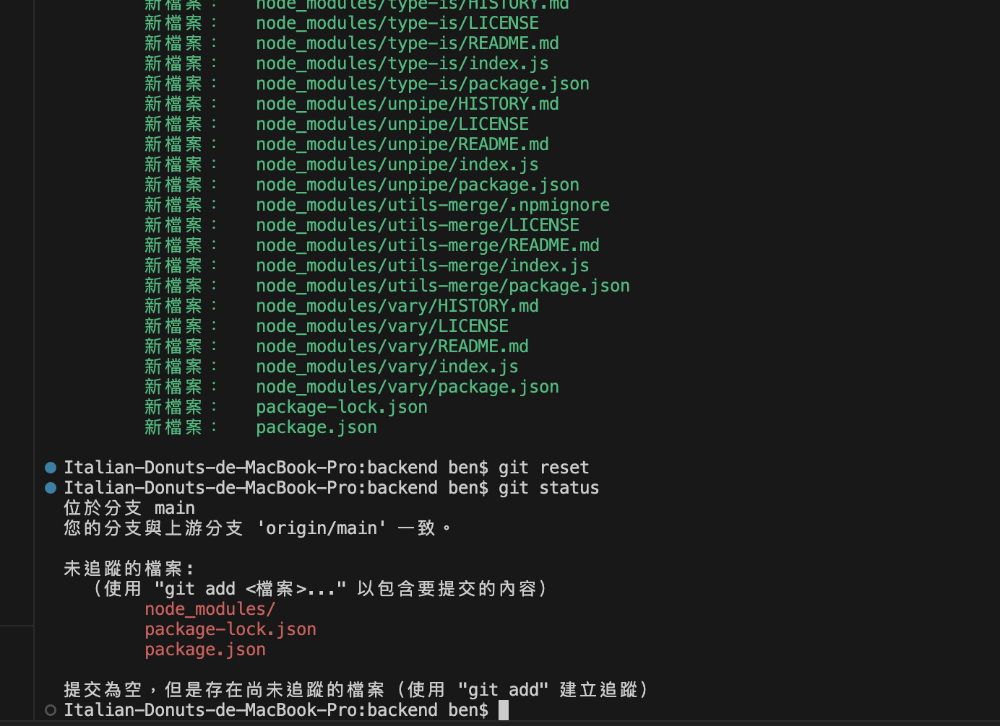
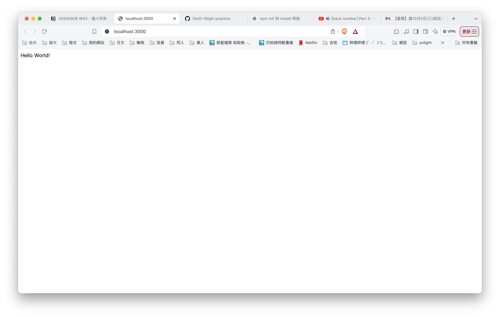

## week-03 to-do list
- [x] 課程筆記
- [x] 作業A
- [x] 作業B
- [x] 作業C
- [x] 作業D

## 9/26的課程筆記

放一下上課的時候做的筆記，試著練習再整理一次。

### JS程式題
---
#### 第二題
原本的題目是
``` JS
let user = {};
user.name = "John";
user.surname = " Smith";
user.name = "Pete";
delete user.name;

for (let key in user){
    console.log(key);
}
```

這題的話知道 name 會改成 "Pete" 之後再整個刪掉，所以 user 只剩下 surname，值是 "Smith" 。

直覺想的時候確實覺得會print surname，但又覺得那個 key 是不是老師故意放的陷阱，改成其他提示詞應該也可以，只是表示 user 裡面的東西。所以想成會 print "Smith"，選了以上皆非。

```JS
let user = {};
user.name = "John";
user.surname = " Smith";
user.name = "Pete";
delete user.name;

for (let temp in user){
    console.log(temp);
}
```
後來按照想的把 key 改成 temp，確實輸出還是 surname。

---
#### 第四題
let car 2 = car 1的時候抄的是地址，所以是 shallow copy。

stack 跟 heap，真正儲存資料的的地方在 heap，stack 要一塊記憶體，指向同一個位子。

```JS
car2 ={
  owner:"Jack",
}
```

的時候，Heap 會要一塊新的記憶體存 "owner" 是 Jack；然後 stack 裡面的 car2 指向新的地址，所以有成功改到。

- 大括號出來的時候，Heap 已經開了一塊新的空間存。
- stack 裡的 car1 是物件，指向 heap 的空間。

---
#### Q：JS 中要如何 DeepCopy？

A:（待補）（可以找資料，但分析每一種方法使用的時機、優缺點。）

#### Q2: 物件中如果還放一個物件，那使用...的時候，只抄到第一層還是全抄？

```jsx
let car1 ={
  brand: 'ford',
  color: 'red',
  owner: 'Paul',
  object: ...
};
```

```jsx
let car2 = {...car1, owner:'John', price:10000};
```

A: (待補）

---
#### 第九題

```Js
console.log('start');
setTimeout(() => {
  console.log('timeout');
}, 0);
console.log('after');
```
輸出是 start, after, timeout

---
#### sum.js

array 函式都可以用 for 迴圈實作、可以練習

也許函式的效能較差 → 在效能和可讀性之間做抉擇

還是取決於程式碼在哪裡跑，每個環境上有一些實作上的細節差異

---
#### 關於coding 的一些雜項：

- 先把 validation 做好，input確定沒問題了再做操作
- early return

---

## 作業 A

#### 什麼是 AWS Region, AZ (availability zones)

- AWS Region 是 AWS 分散在全球不同地方的數據中心，具體在頁面右上角可以切換。
- AZ (availability zones) 則是分佈在同一個區域內不同數據中心，用來提高容錯；即使一個 AZ 掛了也可以切換到其他的。
- 所以一個 AWS Region 內包含了多個 AZ。

#### 如果你要使用 AWS 服務，你會怎麼選擇用哪個 Region，考慮的因素有哪些？

- 考慮的因素我第一個想到的是距離因素，盡量選擇靠近客戶端的地區，物理距離上比較近，延遲比較低。
- 再來的話我會考慮成本，不同 Region 的成本好像會不同，沒有特別要求的話當然先選便宜的。
- 其他可能就是像老師說的看情況來決定。

作業 B
---
一開始的嘗試是直觀的

```JS
doJob('刷牙', 1000, function (data) {
    console.log(data);
});

doJob('吃早餐', 3000, function (data) {
    console.log(data);
});

doJob('寫功課', 1000, function (data) {
    console.log(data);
});

doJob('吃午餐', 2000, function (data) {
    console.log(data);
});
```
但發現這樣的輸出會是：


明顯和老師要求的不同，給我的感覺有點像是課堂上考試的那題一樣（？），找了一些資料後才知道要用巢狀的方式。

另外，在檢查圖片有沒有跑出來的時候突然發現這邊給的時間戳記不是台灣的時區，查了一下是給標準時間。

但如果要調成台灣本地時間的話應該需要動到老師的 code（又或許有不用動到的方法），但不管怎樣記錄一下自己的發現在這裡。

參考資料在 [這邊](https://ithelp.ithome.com.tw/articles/10231926) 和 [這邊](https://github.com/aszx87410/blog/issues/66)

作業C
---

#### 觀察 package.json 的變化

```JS
npm init
```


```JS
npm install express
```


- 觀察 package.json 的變化

這題小緊張了一下。我按照題目順序，在執行完 `npm install express` 才去看 package.json 的內容。

長得像是這樣：



發現此時package內已經有一個 dependencies，就是剛剛裝的 `"express": "^4.21.0"`。

但還是不知道一開始 `npm init` 之後的狀態，我就想說如果重新 `npm init` 也許可以？


結果長得像是這樣，發現他多了 `"devDependencies": {}, "description": ""`

並且 `"express": "^4.21.0"`也還在，所以我覺得應該是沒有 `npm init` 到。



我問了 ChatGPT 什麼時候會出現這樣的 devDependencies ，得到的回覆是：

> 使用 --save-dev 安裝某個開發相關的套件，會將該套件記錄到 devDependencies 中

但我也沒有執行上面的指令，所以想先擺著。

---

到這邊本來想要重開一個資料夾，然後執行`npm init`。

最後發現其實當初在 init 的時候要我輸入的一些資訊就是 package.json 的內容，並且剛好有留下紀錄（在截圖 init 的時候）。


發現基本上就是沒有 dependencies 那一項～

---

#### 觀察 node_modules 裡面有什麼

這題我在順序前面一點的時候就不小心看到裡面的內容了(?)

我在執行完 `npm install express` 之後沒有先確認到底做了什麼事，就想要 push 回 gitgub 上面，想要從上面看。

好險有先看了一下 status ，發現超多東西，感覺就不能都 push 上去。



然後就趕快 reset：



想了一下老師上課講過能載下來的應該不要推上 github，所以去加了 .gitignore 文件把 node_modules/ 給忽略。

最後補一下以瀏覽器開啟 http://localhost:3000/ 的結果：


