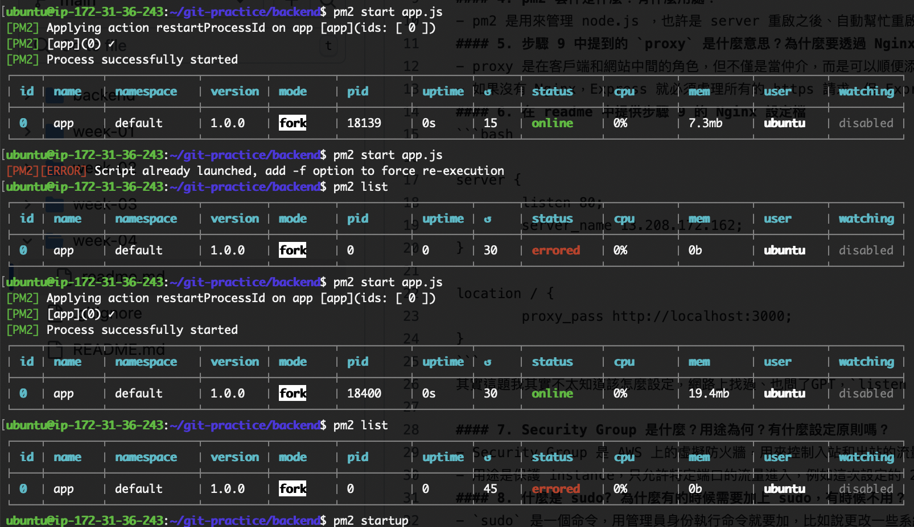

建立 EC2 主機與部署 Web Server
---
#### 1. instance 的 public IP：13.208.172.162
#### 2. 什麼是 instance type?
- instance type 就是每個 instance 的規格，規定了不同的 CPU, RAM 等等，規格越好的 instance 價格也越貴。
#### 3. 什麼是 Nginx？有哪些用途與特性？
- 如果今天網站需要面對高流量的訪問，一台主機可能應付不過來，此時可能會想要架設多台主機來應付，但此時的問題會變成 user 不知道該訪問哪一台主機。
- 而 Nginx 就是介在 server 和 user 中間、負責分配哪一台 server 要來回應。
#### 4. pm2 套件是什麼？有什麼用處？
- pm2 是用來管理 node.js ，也許是 server 重啟之後、自動幫忙重啟程式；或是幫忙整理 log 等等。
#### 5. 步驟 9 中提到的 `proxy` 是什麼意思？為什麼要透過 Nginx 來 `proxy` 到 Express 開發的 Web Server?
- proxy 是在客戶端和網站中間的角色，但不僅是當仲介，而是可以順便添加安全性、提高性能、負載均衡等等。
- 如果沒有 Nginx，Express 就必須處理所有的 https 請求，但 Express 應該是用來管理程式碼的框架；有了 Nginx 作為第一道防線，就可以專心處理程式的事情。
#### 6. 在 readme 中提供步驟 9 的 Nginx 設定檔
```bash

server {
        listen 80;
        server_name 13.208.172.162;
}

location / {
        proxy_pass http://localhost:3000;
}
```
其實這題我其實不太知道該怎麼設定，網路上找過、也問了GPT，`listen 80`那邊我記得原來是`listen 80 default`，其實感覺可以不用更動，但我看網路上的範例好像都有刪掉。

#### 7. Security Group 是什麼？用途為何？有什麼設定原則嗎？
- Security Group 是 AWS 上的虛擬防火牆，用來控制入站和出站的流量。
- 用途是保護 instance，只允許特定端口的流量進入，例如這次設定的 22（SSH）和 80（HTTP）。
#### 8. 什麼是 sudo? 為什麼有的時候需要加上 sudo，有時候不用？
- `sudo` 是一個命令，用管理員身份執行命令就要加，比如說更改一些系統文件的時候。
#### 9. Nginx 的 Log 檔案在哪裡？你怎麼找到的？怎麼看 Nginx 的 Log？
- Access Log：/var/log/nginx/access.log
- Error Log：/var/log/nginx/error.log
#### 10. 其他你在過程中遭遇的問題
- Nginx 的設定檔不知道如何設定，且 `start app.js`時會顯示 status online，看網站沒出現；回頭叫 list 看狀態時發現其實沒開起來，不知道為什麼會這樣。

   

  但最後的解決方法是把設定檔重新 startup 就解決了。（可能是設定檔沒有套用上去？）

